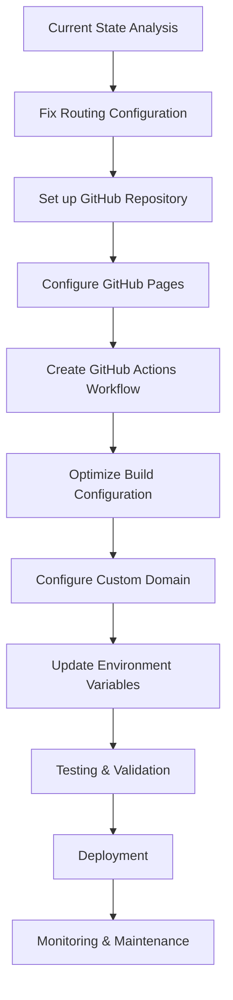

# GitHub Pages Deployment Plan for Properties 4 Creation

## 🎯 Project Overview

**Project**: Properties 4 Creation - Veteran-owned affordable housing platform
**Domain**: www.properties4creations.com
**Tech Stack**: React 19 + Vite + TypeScript + Tailwind CSS
**Hosting**: GitHub Pages with custom domain
**Repository**: https://github.com/kyletbuzbee/p4c-web.git

## 📋 Current State Analysis

### ✅ Already Configured

- **CNAME file**: Properly configured for `www.properties4creations.com`
- **Vite configuration**: GitHub Pages base path setup (`vite.config.ts`)
- **Package.json scripts**: Deployment scripts ready (`deploy:github`, `predeploy`, `deploy`)
- **404.html**: SPA fallback page implemented
- **Build dependencies**: `gh-pages` package installed

### ⚠️ Issues Identified

- **Routing**: Currently using `BrowserRouter` - needs conversion to `HashRouter` for GitHub Pages
- **Missing GitHub Actions**: No automated deployment workflow
- **Environment variables**: API keys exposed in `.env.local` (security issue)
- **Build optimization**: Missing production-specific optimizations

## 🗺️ Deployment Roadmap



## 📝 Detailed Implementation Plan

### Phase 1: Prerequisites & Repository Setup

#### 1.1 Repository Configuration

```bash
# If repository doesn't exist, create and push
git init
git add .
git commit -m "Initial commit for GitHub Pages deployment"
git branch -M main
git remote add origin https://github.com/kyletbuzbee/p4c-web.git
git push -u origin main
```

#### 1.2 GitHub Repository Settings

- **Repository visibility**: Public (required for free GitHub Pages)
- **Default branch**: `main`
- **Branch protection**: Enable for `main` branch
- **Security**: Enable Dependabot alerts

### Phase 2: Fix Application Configuration

#### 2.1 Convert Router to HashRouter

**File**: `App.tsx`

Replace:

```typescript
import { Routes, Route } from 'react-router-dom';
```

With:

```typescript
import { HashRouter, Routes, Route } from 'react-router-dom';
```

Wrap the entire routing structure:

```typescript
<HashRouter>
  <div className="font-sans antialiased text-p4c-navy bg-p4c-beige min-h-screen flex flex-col">
    {/* ... existing content ... */}
  </div>
</HashRouter>
```

**Why HashRouter?**

- GitHub Pages doesn't support server-side routing
- HashRouter uses URL fragments (`#`) for client-side routing
- URLs will look like: `https://www.properties4creations.com/#/about`

#### 2.2 Environment Variables Security Fix

**File**: `.env.local` → **Remove sensitive data**

Create `.env.production` template:

```env
# DO NOT COMMIT THIS FILE
# Use GitHub Secrets for production environment variables
# VITE_API_URL=https://your-backend-api.com
# VITE_GEMINI_API_KEY=your-api-key-here
```

**Remove from repository**:

- Delete `.env.local` from Git
- Add `.env*` to `.gitignore`

### Phase 3: GitHub Pages Configuration

#### 3.1 Enable GitHub Pages

1. Go to repository → **Settings** → **Pages**
2. Under **Source**, select **GitHub Actions**
3. Save settings
4. Note: This enables automatic deployment from Actions

#### 3.2 Custom Domain Configuration

1. In **Settings** → **Pages**, scroll to **Custom domain**
2. Enter: `www.properties4creations.com`
3. Check **Enforce HTTPS** (GitHub will automatically provision SSL certificate)
4. Save

#### 3.3 DNS Configuration (External)

**For domain registrar (e.g., GoDaddy, Namecheap):**

Add these DNS records:

```
Type: CNAME
Name: www
Value: kyletbuzbee.github.io
TTL: 3600
```

```
Type: A
Name: @ (or leave blank)
Value: 185.199.108.153
TTL: 3600
```

```
Type: A
Name: @ (or leave blank)
Value: 185.199.109.153
TTL: 3600
```

```
Type: A
Name: @ (or leave blank)
Value: 185.199.110.153
TTL: 3600
```

```
Type: A
Name: @ (or leave blank)
Value: 185.199.111.153
TTL: 3600
```

### Phase 4: GitHub Actions Workflow

#### 4.1 Create Deployment Workflow

**File**: `.github/workflows/deploy.yml`

```yaml
name: Deploy to GitHub Pages

on:
  push:
    branches: [main]
  pull_request:
    branches: [main]

jobs:
  deploy:
    runs-on: ubuntu-latest
    environment:
      name: github-pages
      url: ${{ steps.deployment.outputs.page_url }}

    steps:
      - name: Checkout repository
        uses: actions/checkout@v4

      - name: Setup Node.js
        uses: actions/setup-node@v4
        with:
          node-version: '18'
          cache: 'npm'

      - name: Install dependencies
        run: npm ci

      - name: Build application
        run: npm run build
        env:
          # Optional: Set repository name for base path
          VITE_REPOSITORY_NAME: ${{ github.event.repository.name }}

      - name: Setup Pages
        uses: actions/configure-pages@v4

      - name: Upload artifact
        uses: actions/upload-pages-artifact@v4
        with:
          path: ./dist

      - name: Deploy to GitHub Pages
        id: deployment
        uses: actions/deploy-pages@v4
```

#### 4.2 Alternative: Using gh-pages Action

If you prefer the `gh-pages` package approach:

```yaml
name: Deploy to GitHub Pages

on:
  push:
    branches: [main]

jobs:
  deploy:
    runs-on: ubuntu-latest
    steps:
      - uses: actions/checkout@v4

      - name: Setup Node.js
        uses: actions/setup-node@v4
        with:
          node-version: '18'
          cache: 'npm'

      - name: Install dependencies
        run: npm ci

      - name: Build
        run: npm run build
        env:
          VITE_REPOSITORY_NAME: ${{ github.event.repository.name }}

      - name: Deploy to GitHub Pages
        uses: peaceiris/actions-gh-pages@v3
        with:
          github_token: ${{ secrets.GITHUB_TOKEN }}
          publish_dir: ./dist
          force_orphan: true
```

### Phase 5: Production Build Optimization

#### 5.1 Vite Configuration Updates

**File**: `vite.config.ts`

Add production-specific optimizations:

```typescript
export default defineConfig(({ mode }) => {
  const env = loadEnv(mode, '.', '');

  const isProduction = mode === 'production';
  const repositoryName = process.env.VITE_REPOSITORY_NAME || '';
  const base = isProduction ? `/${repositoryName}/` : '/';

  return {
    // ... existing configuration
    build: {
      // ... existing build config
      // Add production optimizations
      rollupOptions: {
        output: {
          // ... existing manual chunks
          // Add compression
          manualChunks: {
            // ... existing chunks
            // Add vendor chunks for better caching
            vendor: ['react', 'react-dom'],
            router: ['react-router-dom'],
            ui: ['lucide-react'],
            utils: ['react-helmet-async'],
          },
        },
      },
      // Enable minification
      minify: 'terser',
      terserOptions: {
        compress: {
          drop_console: true,
          drop_: true,
        },
      },
    },
  };
});
```

#### 5.2 Performance Optimizations

- **Image optimization**: Pre-optimize all images in `/images/` directory
- **Bundle analysis**: Run `npm run build -- --mode production` and analyze bundle size
- **Code splitting**: Ensure lazy loading is working for all routes

### Phase 6: Testing & Validation

#### 6.1 Pre-Deployment Checklist

- [ ] HashRouter conversion completed
- [ ] GitHub repository created and populated
- [ ] GitHub Pages enabled in repository settings
- [ ] DNS records updated at domain registrar
- [ ] GitHub Actions workflow created
- [ ] Build process completes without errors
- [ ] All environment variables secured
- [ ] Custom domain configured

#### 6.2 Testing Procedures

**Local Testing:**

```bash
# Test build process
npm run build

# Test production preview
npm run preview

# Test all routes work with HashRouter
# Visit: http://localhost:4173/#/about
# Visit: http://localhost:4173/#/contact
# Visit: http://localhost:4173/#/properties/1
```

**Post-Deployment Testing:**

```bash
# After deployment, test:
# 1. Main domain works: https://www.properties4creations.com
# 2. All routes work: https://www.properties4creations.com/#/about
# 3. HTTPS is enforced
# 4. 404 page shows for non-existent routes
# 5. Images and assets load correctly
# 6. Forms and interactive elements work
```

#### 6.3 Validation Steps

1. **GitHub Pages Status**: Check deployment status in repository → Settings → Pages
2. **SSL Certificate**: Verify HTTPS is working and certificate is valid
3. **Domain Propagation**: Wait 24-48 hours for DNS changes to propagate
4. **Mobile Testing**: Test on mobile devices
5. **Performance Testing**: Use Lighthouse or similar tools

### Phase 7: Post-Deployment Maintenance

#### 7.1 Monitoring

- **GitHub Actions**: Monitor deployment workflows
- **GitHub Pages**: Check deployment status regularly
- **Domain**: Monitor SSL certificate expiration
- **Performance**: Regular performance audits

#### 7.2 Update Process

```bash
# Standard deployment workflow:
git add .
git commit -m "Update website content"
git push origin main
# GitHub Actions will automatically deploy
```

#### 7.3 Troubleshooting Guide

**Common Issues:**

1. **404 Errors After Deployment**
   - Check that `HashRouter` is being used
   - Verify `base` path in `vite.config.ts`
   - Ensure `404.html` is in the correct location

2. **Assets Not Loading**
   - Check that paths in `vite.config.ts` are correct
   - Verify `base` configuration matches repository structure
   - Ensure `public` assets are in correct location

3. **Custom Domain Not Working**
   - Verify DNS records are correct
   - Check that GitHub Pages custom domain setting is configured
   - Wait for DNS propagation (up to 48 hours)

4. **Build Failures**
   - Check GitHub Actions logs
   - Verify all dependencies are installed
   - Check for TypeScript compilation errors

## 🔧 Configuration Files Summary

### Files to Create/Modify:

1. **`.github/workflows/deploy.yml`** - GitHub Actions workflow
2. **`App.tsx`** - Convert to HashRouter
3. **`.env.local`** - Remove sensitive data, add to .gitignore
4. **`vite.config.ts`** - Production optimizations
5. **`.gitignore`** - Ensure environment files are ignored

### Files Already Configured:

- ✅ `CNAME` - Custom domain setup
- ✅ `404.html` - SPA fallback
- ✅ `package.json` - Build scripts
- ✅ `vite.config.ts` - Base configuration

## 📊 Performance Targets

- **First Contentful Paint**: < 1.5s
- **Largest Contentful Paint**: < 2.5s
- **Cumulative Layout Shift**: < 0.1
- **First Input Delay**: < 100ms
- **Bundle Size**: < 1MB total

## 🚀 Go-Live Checklist

- [ ] All code changes merged to `main` branch
- [ ] GitHub Actions workflow tested
- [ ] DNS changes propagated
- [ ] SSL certificate active
- [ ] All routes tested with HashRouter
- [ ] Performance metrics meet targets
- [ ] Mobile responsiveness verified
- [ ] Accessibility standards met
- [ ] Backup plan documented

## 📞 Support & Resources

### GitHub Pages Documentation

- [GitHub Pages User Guide](https://docs.github.com/en/pages)
- [Custom Domains](https://docs.github.com/en/pages/configuring-a-custom-domain-for-your-github-pages-site)
- [GitHub Actions for Pages](https://docs.github.com/en/pages/getting-started-with-github-pages/automatically-building-and-deploying-your-github-pages-site-with-github-actions)

### React Router Documentation

- [HashRouter vs BrowserRouter](https://reactrouter.com/en/main/router-components/hash-router)
- [GitHub Pages Deployment Guide](https://create-react-app.dev/docs/deployment/#github-pages)

### Domain Configuration

- [GitHub Pages DNS Records](https://docs.github.com/en/pages/configuring-a-custom-domain-for-your-github-pages-site/managing-a-custom-domain-for-your-github-pages-site#configuring-a-records-and-an-apex-domain)
- [SSL Certificate Management](https://docs.github.com/en/pages/configuring-a-custom-domain-for-your-github-pages-site/securing-your-github-pages-site-with-https)

---

**Next Steps**: Ready to implement this plan? The most critical step is converting to HashRouter, followed by setting up the GitHub Actions workflow for automated deployment.
