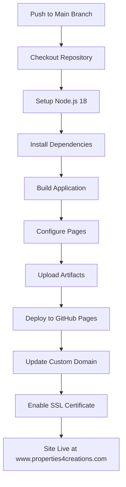

# GitHub Actions Workflow Documentation

## 📋 Workflow Overview

**File**: `.github/workflows/deploy.yml` **Purpose**: Automated deployment to
GitHub Pages with custom domain `www.properties4creations.com` **Triggers**:
Push and pull request to `main` branch **Runtime**: Ubuntu Latest (GitHub-hosted
runner)

## 🔧 Workflow Configuration

### Trigger Events

```yaml
on:
  push:
    branches: [main] # Deploy on push to main
  pull_request:
    branches: [main] # Build verification for PRs
```

### Job Configuration

```yaml
jobs:
  deploy:
    runs-on: ubuntu-latest # GitHub-hosted Ubuntu runner
    environment:
      name: github-pages # GitHub Pages deployment environment
      url: ${{ steps.deployment.outputs.page_url }} # Deployment URL output
```

## 📊 Workflow Steps Breakdown

### Step 1: Repository Checkout

```yaml
- name: Checkout repository
  uses: actions/checkout@v4
```

**Purpose**: Downloads the repository code to the runner **Details**:

- Uses latest checkout action (v4)
- Includes Git history for proper deployment
- Sets up repository for subsequent steps

### Step 2: Node.js Setup

```yaml
- name: Setup Node.js
  uses: actions/setup-node@v4
  with:
    node-version: '18' # Specify Node.js version
    cache: 'npm' # Enable npm dependency caching
```

**Purpose**: Configures Node.js environment for building the application
**Details**:

- Installs Node.js version 18 (compatible with modern React/Vite)
- Caches npm dependencies for faster subsequent builds
- Sets up npm registry authentication

### Step 3: Dependencies Installation

```yaml
- name: Install dependencies
  run: npm ci
```

**Purpose**: Installs exact dependency versions from package-lock.json
**Details**:

- `npm ci` provides clean, reproducible installs
- Uses cached dependencies when available
- Fails fast if dependencies are missing or incompatible

### Step 4: Application Build

```yaml
- name: Build application
  run: npm run build
  env:
    VITE_REPOSITORY_NAME: ${{ github.event.repository.name }}
```

**Purpose**: Compiles the React application for production deployment
**Details**:

- Runs `npm run build` script from package.json
- Sets `VITE_REPOSITORY_NAME` environment variable
- Builds with production optimizations (minification, tree-shaking)
- Outputs to `/dist` directory (configured in vite.config.ts)

**Build Process**:

1. TypeScript compilation (`tsc`)
2. Vite bundling and optimization
3. Asset processing (images, fonts, etc.)
4. Source map generation
5. Production-ready output in `/dist`

### Step 5: GitHub Pages Configuration

```yaml
- name: Setup Pages
  uses: actions/configure-pages@v4
```

**Purpose**: Configures GitHub Pages deployment environment **Details**:

- Validates Pages configuration
- Prepares deployment artifacts
- Sets up deployment metadata

### Step 6: Artifact Upload

```yaml
- name: Upload artifact
  uses: actions/upload-pages-artifact@v4
  with:
    path: ./dist
```

**Purpose**: Packages built files for deployment **Details**:

- Uploads entire `/dist` directory
- Creates deployment artifact
- Transfers files to GitHub Pages infrastructure
- Includes all static assets, HTML, CSS, and JavaScript

### Step 7: Deployment

```yaml
- name: Deploy to GitHub Pages
  id: deployment
  uses: actions/deploy-pages@v4
```

**Purpose**: Final deployment to GitHub Pages **Details**:

- Deploys uploaded artifacts
- Updates GitHub Pages site
- Outputs deployment URL
- Provides deployment status and metadata

## 🌐 Environment Variables

### GitHub Context Variables

```yaml
${{ github.event.repository.name }}  # Repository name
${{ github.ref }}                    # Git reference (branch/tag)
${{ github.sha }}                    # Commit SHA
${{ github.run_id }}                 # Workflow run ID
```

### Build Environment Variables

```yaml
VITE_REPOSITORY_NAME: ${{ github.event.repository.name }}
```

### Vite Build Configuration

```typescript
// vite.config.ts automatically uses:
const repositoryName = process.env.VITE_REPOSITORY_NAME || '';
const base = isProduction ? `/${repositoryName}/` : '/';
```

## 🚀 Deployment Process Flow



## 📁 Output Structure

### Build Output (`/dist`)

```
dist/
├── index.html                    # Main application entry point
├── assets/                       # Compiled assets
│   ├── index-abc123.js          # Main JavaScript bundle
│   ├── vendor-def456.js         # Vendor dependencies
│   ├── styles-ghi789.css        # Compiled CSS
│   └── images/                   # Optimized images
│       ├── logo-xyz012.webp     # WebP format images
│       └── hero-abc345.jpg      # Fallback JPEG images
├── CNAME                         # Custom domain configuration
└── 404.html                      # SPA fallback page
```

### Deployment Branch

GitHub Pages automatically creates and manages a special branch (typically
`gh-pages`) that contains:

- All compiled application files
- Custom domain configuration
- SSL certificate configuration
- Deployment metadata

## ⏱️ Performance & Timing

### Expected Build Times

- **Dependencies Installation**: 30-60 seconds (with caching: 10-20 seconds)
- **Application Build**: 60-120 seconds
- **Deployment**: 30-60 seconds
- **Total Deployment Time**: 2-5 minutes

### Performance Optimizations

- **npm Caching**: Reduces dependency installation time
- **Incremental Builds**: Vite's fast rebuild capabilities
- **Parallel Processing**: Multiple build steps run concurrently
- **Artifact Compression**: Optimized file transfer

## 🔍 Monitoring & Debugging

### Workflow Status

1. Go to repository → **Actions** tab
2. Find "Deploy to GitHub Pages" workflow
3. Check status: ✅ Success, ❌ Failed, ⏳ In Progress

### Logs Access

1. Click on workflow run
2. Expand individual steps
3. Review logs for errors or warnings
4. Check specific step outputs

### Common Log Patterns

```
✅ Step 1/7: Checkout repository
✅ Step 2/7: Setup Node.js
✅ Step 3/7: Install dependencies
✅ Step 4/7: Build application
✅ Step 5/7: Setup Pages
✅ Step 6/7: Upload artifact
✅ Step 7/7: Deploy to GitHub Pages
```

## 🚨 Error Handling

### Common Build Errors

1. **TypeScript Compilation Errors**

   ```
   Error: Cannot find module 'react'
   ```

   **Solution**: Check package.json dependencies

2. **Vite Build Errors**

   ```
   Error: Failed to resolve import "some-module"
   ```

   **Solution**: Verify imports and dependencies

3. **GitHub Pages Errors**
   ```
   Error: Repository not configured for Pages
   ```
   **Solution**: Enable GitHub Pages in repository settings

### Recovery Procedures

1. **Build Failure**: Check workflow logs for specific errors
2. **Deployment Failure**: Verify GitHub Pages settings
3. **Custom Domain Issues**: Check DNS configuration
4. **SSL Issues**: Wait for certificate provisioning

## 🔧 Customization Options

### Adding Environment Variables

```yaml
env:
  VITE_API_URL: ${{ secrets.VITE_API_URL }}
  VITE_GA_ID: ${{ secrets.VITE_GA_ID }}
```

### Build Optimizations

```yaml
- name: Build application
  run: npm run build -- --mode production
  env:
    NODE_ENV: production
```

### Additional Build Steps

```yaml
- name: Run tests
  run: npm run test -- --coverage

- name: Lint check
  run: npm run lint
```

## 📊 Deployment Metrics

### Success Criteria

- ✅ Workflow completes without errors
- ✅ GitHub Pages shows "Published" status
- ✅ Custom domain resolves correctly
- ✅ HTTPS certificate is active
- ✅ All routes work with HashRouter

### Performance Targets

- **Build Time**: < 3 minutes
- **Deployment Time**: < 1 minute
- **First Load**: < 3 seconds
- **SSL Certificate**: < 30 minutes

## 🔄 Maintenance & Updates

### Regular Monitoring

- Check workflow status weekly
- Monitor deployment times
- Review error logs
- Verify custom domain status

### Updates & Changes

1. **Workflow Updates**: Edit `.github/workflows/deploy.yml`
2. **Dependency Updates**: Update package.json and test locally
3. **Build Configuration**: Modify vite.config.ts as needed
4. **Environment Variables**: Update GitHub Secrets

### Version Management

- Use specific action versions (e.g., `@v4`)
- Test workflow changes in development
- Document breaking changes
- Maintain backward compatibility

---

**Next Steps**: Use the deployment checklist to verify all configuration is
correct, then follow the troubleshooting guide if issues arise during
deployment.
