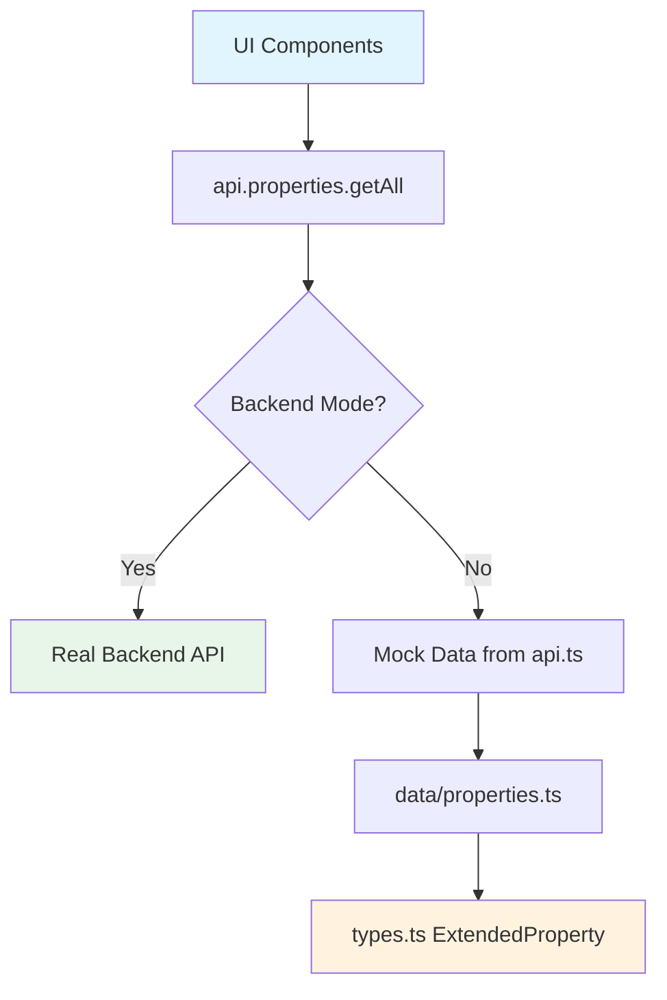

# UX Optimization Plan

## Overview

This plan addresses UX improvements including accessibility fixes, data access
layer violations, animation enhancements, and component improvements for the
Properties 4 Creation website.

---

## Issue 1: Data Access Layer Violations

### Problem

Three files import `ExtendedProperty` type directly from `data/properties.ts`,
violating the architectural rule that UI components should remain blind to data
sources.

### Files Affected

- [`pages/Home.tsx`](pages/Home.tsx:9) -
  `import type { ExtendedProperty } from '../data/properties';`
- [`pages/PropertyDetails.tsx`](pages/PropertyDetails.tsx:4) -
  `import type { ExtendedProperty } from '../data/properties';`
- [`pages/AdminDashboard.tsx`](pages/AdminDashboard.tsx:15) -
  `import type { ExtendedProperty } from '../data/properties';`
- [`services/api.ts`](services/api.ts:6) - Also imports `ExtendedProperty` from
  data

### Solution

1. Move `ExtendedProperty` interface from `data/properties.ts` to `types.ts`
2. Update imports in all affected files to use `types.ts`
3. Remove type export from `data/properties.ts` (keep the data export for API
   service)

---

## Issue 2: ToastContext UX Issues

### Problem

- Uses non-existent `animate-slide-in` CSS class
- Missing ARIA live region for screen reader announcements

### Files Affected

- [`context/ToastContext.tsx`](context/ToastContext.tsx:53)

### Solution

1. Replace `animate-slide-in` with existing `slide-in-from-bottom` animation
2. Add `role="alert"` and `aria-live="polite"` to toast container for
   accessibility
3. Ensure proper focus management when toasts appear/disappear

---

## Issue 3: SkipLink Accessibility Improvements

### Problem

The skip link implementation could be improved for better accessibility:

- Could benefit from Escape key dismissal
- Could use better visual feedback during focus

### Files Affected

- [`components/SkipLink.tsx`](components/SkipLink.tsx)

### Solution

1. Add Escape key listener to dismiss the skip link
2. Improve visual styling for better visibility when focused
3. Ensure proper screen reader announcements

---

## Issue 4: Prefers-Reduced-Motion Support

### Problem

Current animations don't properly respect `prefers-reduced-motion`:

- Inline Tailwind animations bypass CSS media query
- FAQ accordion animations need dedicated reduced-motion styles

### Files Affected

- [`index.css`](index.css)
- [`pages/FAQ.tsx`](pages/FAQ.tsx)

### Solution

1. Add CSS custom properties for animation control
2. Update FAQ accordion to use CSS custom properties for animation duration
3. Ensure all Tailwind `animate-*` classes respect reduced motion preferences

---

## Issue 5: FAQ Accordion Smooth Animations

### Problem

The FAQ accordion uses JavaScript-based `maxHeight` calculations which can cause
janky animations. Better to use CSS-based approach with `grid-template-rows` for
smooth animations.

### Files Affected

- [`pages/FAQ.tsx`](pages/FAQ.tsx)

### Solution

1. Refactor FAQ accordion to use CSS `grid-template-rows` transition technique
2. This provides smoother 60fps animations compared to `maxHeight`
3. Add proper `prefers-reduced-motion` support

---

## Issue 6: AdminDashboard Skeleton Component

### Problem

The AdminDashboard currently uses inline skeleton loading states instead of a
reusable skeleton component.

### Files Affected

- [`pages/AdminDashboard.tsx`](pages/AdminDashboard.tsx)

### Solution

1. Create `AdminDashboardSkeleton.tsx` component in `components/` directory
2. The skeleton should include:
   - Sidebar skeleton
   - Stats grid skeleton
   - Properties table skeleton
3. Replace inline loading states with the new component

---

## Implementation Order

1. **Fix Data Access Layer** - Move ExtendedProperty type to types.ts and update
   imports
2. **Fix ToastContext** - Add ARIA support and fix animation class
3. **Improve SkipLink** - Add Escape key dismissal and better accessibility
4. **Add Reduced-Motion CSS** - Update index.css with better animation controls
5. **Improve FAQ Accordion** - Refactor to use grid-template-rows animation
6. **Create AdminDashboardSkeleton** - Build reusable skeleton component
7. **Final UX Review** - Verify all changes work together

---

## Mermaid Diagram: Data Flow After Fixes

